# Fathom Inventory - Technical Documentation

> **User Guide**: For quick start and daily usage, see [README.md](README.md)
> **Authentication**: For all authentication setup and troubleshooting, see [AUTHENTICATION_GUIDE.md](AUTHENTICATION_GUIDE.md)

# Fathom Inventory and Analysis Utilities

## Project Overview

This project provides a suite of tools to download, process, and analyze Fathom meeting summaries. It establishes a robust pipeline to convert unstructured Fathom summary emails into a structured, queryable SQLite database, enabling detailed analysis of meeting metadata and content.

##  Validated Data Extraction Pipeline

As of September 19, 2025, the core data extraction pipeline has been rigorously tested and validated. The process ensures that no data is lost during the conversion from the original HTML email to the structured data fields in the database.

1. **HTML to Markdown Conversion**: The `email_conversion/fathom_email_2_md.py` script reliably converts raw email HTML into clean, parseable Markdown.
2. **Structured Data Parsing**: The `parse_mds/parse_md.py` script parses the Markdown to extract 12 key fields, including meeting titles, dates, participant counts, and detailed metrics like `action_items_count` and `next_steps_count`.
3. **Definitive Validation**: The entire pipeline was validated by comparing the data extracted directly from HTML against the data extracted from the final Markdown. The two independent methods produced **100% identical results** across all 11 test files and all 12 metrics.

For a complete, field-by-field breakdown of the validation results, see the definitive report:
**[./parse_mds/definitive_comparison.md](./parse_mds/definitive_comparison.md)**

## Project Architecture

The project is designed with a modular architecture. The root directory contains the main orchestration scripts that operate on the production database, while the subdirectories (`email_conversion/` and `parse_mds/`) contain self-contained modules that can be developed and tested independently.


* **Root Utilities**: These are the primary scripts for running the production workflow, such as `download_emails.py` and the batch processing scripts. They import and utilize the functionality from the modules.
* **`email_conversion` Module**: A self-contained utility responsible for the single task of converting email HTML to Markdown. It has its own test data and can be validated in isolation.
* **`parse_mds` Module**: A self-contained utility for parsing the clean Markdown and housing the definitive validation tests for the entire data pipeline.
* **`analysis` Module**: A self-contained utility for AI-powered analysis of Fathom meeting data, including batch processing and individual call analysis capabilities.

This separation of concerns ensures that the core logic for conversion and parsing is robust and independently verifiable, while the root utilities handle the higher-level orchestration.

## Automation with `launchd`

## System Workflows and Scripts

The project consists of two primary workflows, orchestrated by the scripts in this root directory. These scripts utilize the self-contained modules in the `email_conversion/`, `parse_mds/`, and `analysis/` subdirectories.

### Script Dependency Table

| Script                               | Purpose                                               | Imports (Local)             | Dependencies (Files, etc.)                                                                                                      |
| :----------------------------------- | :---------------------------------------------------- | :-------------------------- | :------------------------------------------------------------------------------------------------------------------------------ |
| `run_daily_share.py`               | Finds new Fathom calls and shares them.               | `share_fathom_call2`      | **In:** `all_fathom_calls.tsv`, `fathom_cookies.json<br>`**Out:** `all_fathom_calls.tsv`                      |
| `download_emails.py`               | Downloads emails and performs real-time conversion.   | `email_conversion` module | **In:** `credentials.json<br>`**Out:** `fathom_emails.db`, `token.json`                                       |
| `batch_database_converter.py`      | Re-converts all HTML in the database.                 | `email_conversion` module | **In/Out:** `fathom_emails.db`                                                                                          |
| `batch_parse_database.py`          | Parses all MD and populates structured data.          | `parse_mds` module        | **In/Out:** `fathom_emails.db`                                                                                          |
| `analysis/batch_analyze_calls.py`  | Runs AI analysis on a batch of calls.                 | (None)                      | **In:** `../era connections.tsv<br>`**Out:** `../analysis_results.txt<br>`**Calls:** `ask_fathom_ai.py` |
| `analysis/ask_fathom_ai.py`        | Utility to query the Fathom AI for a single call.     | (None)                      | **In:** `../fathom_cookies.json`                                                                                        |
| `analysis/run_analysis_wrapper.py` | Watchdog script to monitor the AI analysis.           | (None)                      | **Calls:** `batch_analyze_calls.py`                                                                                     |
| `share_fathom_call2.py`            | **Module:** Provides the core sharing function. | (None)                      | **In:** `fathom_cookies.json`                                                                                           |
| `generate_architecture_diagram.py` | Utility to generate the architecture diagram.         | (None)                      | **Out:** `project_architecture.png`                                                                                     |

## Project Setup

This project uses a Python virtual environment to manage dependencies.

1. **Create and Activate Virtual Environment**:

   ```bash
   # If the venv directory doesn't exist
   python3 -m venv ../ERA_Admin_venv
   source ../ERA_Admin_venv/bin/activate
   ```
2. **Install Dependencies**:

   ```bash
   pip install -r requirements.txt
   ```
3. **Install System Packages**:
   To generate the project diagrams, you must have Graphviz installed on your system. If you are on macOS with Homebrew, you can install it with:

   ```bash
   brew install graphviz
   ```
4. **Install Playwright Browsers**:

   ```bash
   playwright install
   ```
5. **Provide Fathom Cookies**:
   For scripts that interact directly with **fathom.video**, you must provide browser cookies.

   - Log in to **https://fathom.video** in your web browser.
   - Use a browser extension (e.g., 'Get cookies.txt LOCALLY') to export your cookies for the `fathom.video` domain.
   - Save the exported cookies as `fathom_cookies.json` in this directory.
6. **Provide Google API Credentials**:
   For downloading emails from the **fathomizer** account, you need Google API credentials.

   - Follow the Google Workspace documentation to create a project and enable the Gmail API.
   - Download the client secret file and save it as `credentials.json` in this directory.
   - The first time you run `download_emails.py`, it will prompt you to authorize access, generating a `token.json` file.

To fully automate the Fathom harvesting and archiving workflow, this project uses `launchd`, macOS's native scheduling system. This is a more robust and secure alternative to traditional cron jobs.

The automation is managed by two files:

### `run_all.sh`

* **Purpose**: This is a master shell script that orchestrates the entire harvesting and archiving workflow.
* **Process**:
  1. Activates the project's Python virtual environment.
  2. Changes to the correct directory to ensure all scripts run properly.
  3. Executes `run_daily_share.py`.
  4. Waits for 5 minutes to allow emails to be sent and received.
  5. Executes `download_emails.py`.
  6. Redirects all output and errors to `cron.log` for easy debugging.

### `com.fathominventory.run.plist`

* **Purpose**: This is a configuration file for `launchd`. It defines *what* to run and *when* to run it.
* **Configuration**:
  * **Label**: `com.era.admin.fathom` - A unique name for the job.
  * **Program**: Specifies the full path to the `run_all.sh` script in this directory.
  * **Schedule**: Configured to run daily at 10:00 AM.
  * **Logging**: All output is directed to `cron.log` in this directory.

### Setup Instructions

To activate the schedule, the `.plist` file must be moved to the `~/Library/LaunchAgents` directory and loaded into `launchd`. The commands for this are:

1. **Copy the file**:
   ```bash
   cp ./com.fathominventory.run.plist ~/Library/LaunchAgents/
   ```
2. **Load the job**:
   ```bash
   launchctl load ~/Library/LaunchAgents/com.fathominventory.run.plist
   ```
3. **Verify the job is loaded**:
   ```bash
   launchctl list | grep era
   ```

### Current Status

✅ **Automation is currently active** - The job `com.era.admin.fathom` is installed and will run daily at 10:00 AM.

**Note on Permissions**: On modern macOS, you may need to grant "Full Disk Access" to `/bin/bash` and `/usr/sbin/cron` in **System Settings > Privacy & Security** for `launchd` to have permission to access the script and its related files.

## Next Steps

The core data extraction and validation pipeline is complete and operational. Future enhancements could include:

1. **Enhanced Analysis**: Expand AI analysis capabilities to extract more detailed participant and collaboration insights
2. **Network Visualization**: Create interactive diagrams showing participant relationships and project connections
3. **Integration Improvements**: Streamline the workflow between call discovery, email processing, and analysis
4. **Monitoring Dashboard**: Develop a web interface for monitoring system health and data growth

## Critical Data Files

### all_fathom_calls.tsv - Master Call Registry

**⚠️ CRITICAL FILE**: `all_fathom_calls.tsv` is the **master registry** of all discovered Fathom calls and is essential for proper system operation.

**Without this file, the system will:**

- Perform a full comprehensive rescan of ALL historical Fathom calls
- Download and process emails from all dates (not just recent ones)
- Take hours instead of minutes to complete

**File Structure** (Tab-separated values):

```
Title	Date	Duration	Hyperlink	shareStatus	sharedWith	shareTimestamp
```

**Operation Modes:**

- **Daily Mode** (file exists): Only processes NEW calls since last run - fast execution
- **Rescan Mode** (file missing): Rebuilds entire history from scratch - slow execution

**For new environments:** Always copy this file from a working installation to avoid unnecessary historical processing.

## Complete System Architecture

For a comprehensive view of all file interactions, dependencies, and data flows, see the complete architecture diagram:

```dot
digraph FathomInventoryComprehensive {
    // Graph attributes
    rankdir=TB;
    bgcolor=white;
    fontname=Helvetica;
    fontsize=12;
  
    // Node definitions with styles
    db [shape=cylinder, style=filled, fillcolor=lightblue, fontname="Helvetica-Bold", fontsize=11, label="fathom_emails.db\n(SQLite Database)"];
  
    // Core processing modules
    converter [shape=folder, style=filled, fillcolor=lightgrey, fontname="Helvetica-Bold", fontsize=10, label="fathom_email_2_md.py"];
    parser [shape=folder, style=filled, fillcolor=lightgrey, fontname="Helvetica-Bold", fontsize=10, label="parse_md.py"];
  
    // Config files
    cookies [shape=hexagon, style=filled, fillcolor=lightcyan, fontname=Helvetica, fontsize=9, label="cookies.json"];
    credentials [shape=hexagon, style=filled, fillcolor=lightcyan, fontname=Helvetica, fontsize=9, label="credentials.json"];
    token [shape=hexagon, style=filled, fillcolor=lightcyan, fontname=Helvetica, fontsize=9, label="token.json"];
  
    // Data files
    all_calls [shape=note, style=filled, fillcolor=lightyellow, fontname=Helvetica, fontsize=10, label="all_fathom_calls.tsv"];
    era_connections [shape=note, style=filled, fillcolor=lightyellow, fontname=Helvetica, fontsize=10, label="era_connections.tsv"];
    analysis_results [shape=note, style=filled, fillcolor=lightyellow, fontname=Helvetica, fontsize=10, label="analysis_results.txt"];
  
    // Workflow scripts
    download [shape=box, style="rounded,filled", fillcolor=whitesmoke, fontname=Helvetica, fontsize=10, label="download_emails.py"];
    batch_convert [shape=box, style="rounded,filled", fillcolor=whitesmoke, fontname=Helvetica, fontsize=10, label="batch_database_converter.py"];
    daily_share [shape=box, style="rounded,filled", fillcolor=whitesmoke, fontname=Helvetica, fontsize=10, label="run_daily_share.py"];
  
    // Analysis and automation
    batch_analyze [shape=box, style="rounded,filled", fillcolor=whitesmoke, fontname=Helvetica, fontsize=10, label="batch_analyze_calls.py"];
    ask_fathom [shape=box, style="rounded,filled", fillcolor=whitesmoke, fontname=Helvetica, fontsize=10, label="ask_fathom_ai.py"];
    run_all [shape=diamond, style=filled, fillcolor=orange, fontname="Helvetica-Bold", fontsize=10, label="run_all.sh"];
  
    // Relationships
    // Core workflow relationships
    download -> converter [color=blue, label="imports"];
    download -> credentials [color=orange, label="uses"];
    download -> token [color=orange, label="uses"];
    download -> db [color=red, style=bold, label="writes"];
  
    batch_convert -> converter [color=blue, label="imports"];
    batch_convert -> db [color=red, label="updates"];
  
    daily_share -> cookies [color=orange, label="uses"];
    daily_share -> all_calls [color=green, label="reads/writes"];
  
    // AI Analysis workflow
    batch_analyze -> ask_fathom [color=purple, label="calls"];
    batch_analyze -> era_connections [color=green, label="reads"];
    batch_analyze -> analysis_results [color=green, label="writes"];
    ask_fathom -> cookies [color=orange, label="uses"];
  
    // Automation relationships
    run_all -> daily_share [color=red, style=bold, label="executes"];
    run_all -> download [color=red, style=bold, label="executes"];
  
    // Database interactions
    parser -> db [color=red, label="parses from", style=dashed];
}
```

Alternative view: 



This diagram shows:

- All scripts and their relationships
- Data files and configuration dependencies
- Automation and scheduling workflows
- Testing and validation pipelines
- Module boundaries and interfaces

## Obsolete Code

The `comprehensive_rescan` folder contains obsolete scripts but is kept for historical reference. Their functionality has either been integrated into the main scripts or deprecated.
